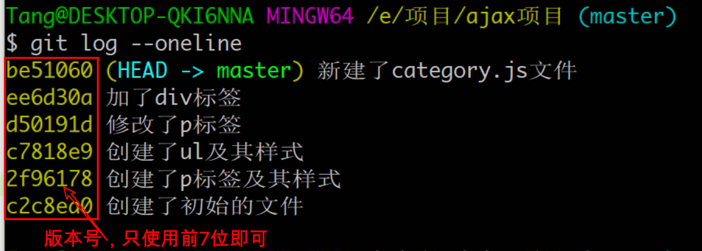
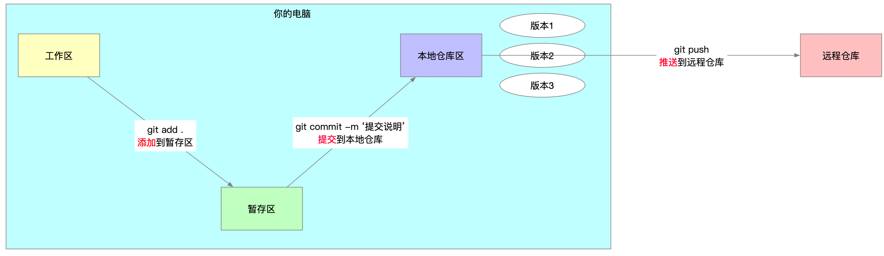
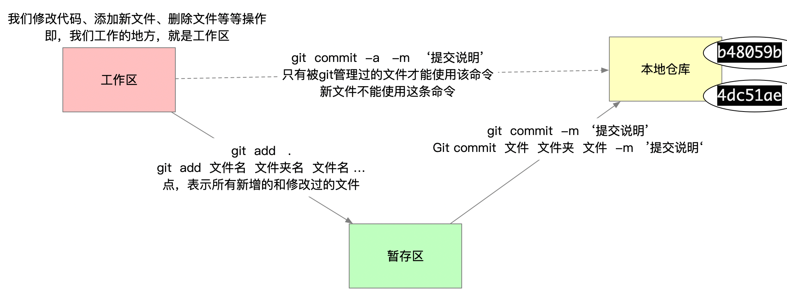
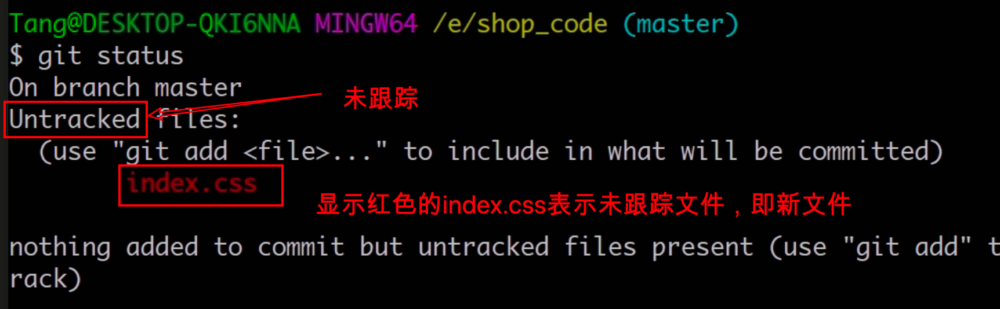
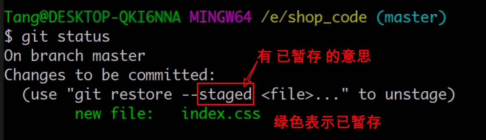
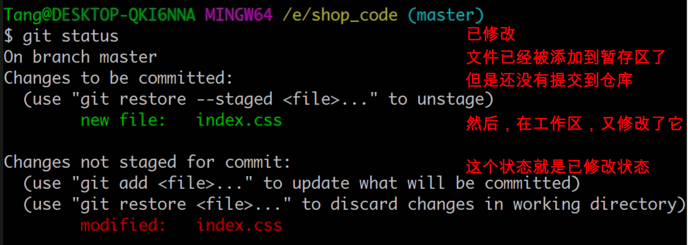
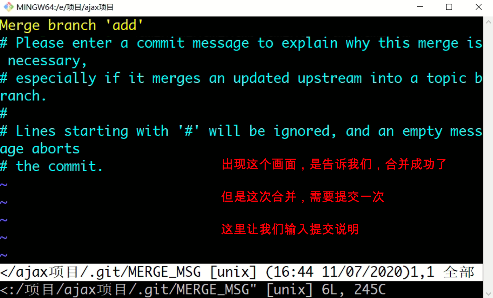
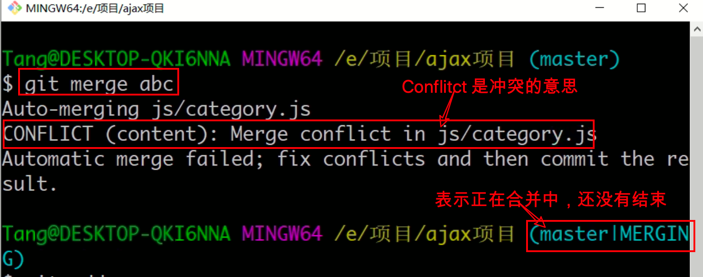
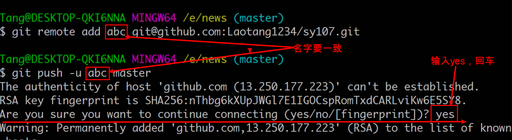

## 准备工作

### 版本管理软件介绍

- 版本指的就是软件的版本，比如 1.2.8 版本、比如 第1版，比如webstorm2020。
- 软件是用代码写出来的。
- 所以，版本指的就是代码的版本。
- 比如一个项目：
    - 搭建好目录结构 ---  第1版本
    - 完成登录页面布局 --- 第2版本
    - 完成登录功能 --- 第3版本
    - 完成分类页面布局 --- 第4版本
    - ...........
- 管理：
    - 记录一个版本
    - 后退一个或多个版本
    - 查看所有的版本
    - 配合远程仓库，实现多人协作
    - ......

- 工作场景一：项目的需求不断的变化，改来改去，也可能需要改回原来的代码。
    - 使用版本管理软件
        - 可以对代码每次的改动做记录，记录一次，叫做形成一个版本。
        - 可以轻松的将代码回退到任意一个版本。（可以使用之前版本中的代码、文件）
        - 电脑关机了，版本也不会丢失。
- 工作场景二：多个合作开发，代码不好合并。
    - 使用版本管理软件 + 远程仓库，可以解决多人合作的问题。


- 作用
    - 记录代码的版本，可以随时回退。
    - 配合远程仓库，实现多人协作，可以很轻松的合并代码
- 版本管理软件分类
    - 集中式，典型代表 SVN
    - 分布式，典型代表 `Git`

### Git安装

- 双击，然后一直下一步安装即可。
- **最好不要安装到含有中文的路径中**。
- 安装完毕，绝对不可以剪切（移动）到其他文件夹。
- 安装完毕，鼠标在任何文件夹空白位置右键，如果出现 `Git Bash Here`，则表示安装成功。(打开终端 --> 输入 git --version  回车)

## 使用前的配置（用到的时候再配置也行）

### 注册码云或github账号

码云和github都提供仓库的托管服务。

区别是码云是国内的服务器，打开速度较快；github是国外的服务器，打开速度不能保证。

码云：https://gitee.com/

github：https://github.com/

自行去这两个网站注册账号，最好使用`相同的邮箱` 分别到码云和github上注册账号。

> 如果你不会在Github上注册，没关系，上课的时候，老师演示。

### 配置码云或github的SSH秘钥

我们向码云或github网站推送代码的时候，最好使用SSH的方案，这个方案需要提前配置好秘钥。下面是具体的配置方法。

任何文件夹位置，空白处右键，选择右键菜单中的 “`Git Bash Here`”，执行下面的命令，可以生成SSH秘钥（包含一个公钥一个私钥）

```bash
ssh-keygen -t rsa -C "你的邮箱地址"
# 比如
ssh-keygen -t rsa -C "tangfengpo@163.com"
# 执行完这个命令之后，后面有一些询问，我们直接一路回车即可
```

> 注意，回车执行命令，然后继续回车，回车....直至生成完毕~

最后生成的秘钥在：

```
Windows：
C:\Users\用户名\.ssh

mac：
你的用户名那个文件夹中。 按shift+Commend+.  可以显示隐藏文件，然后就可以看到 .ssh文件夹了
```

找到 `.ssh/id_rsa.pub`，用vscode打开，复制里面全部的内容，配置到远程仓库

- GitHub右上角的三角号
- Settings
- 左侧有 SSH and GPG keys
- 在显示的界面中，点击右上角的 New SSH key，然后完成添加公钥操作
- 码云的配置方式一样。

### 配置用户名和邮箱

Git软件在工作的时候，需要知道你是谁？所以需要设置一个用户名和邮箱。

这个用户名和邮箱，最好使用你的[github](https://github.com/)账号或[码云](https://gitee.com/)账号，当然随便填也可以。

具体做法：

1. **任何**文件夹，空白处，右键 --> Git Bash Here
2. 依次执行下面两行代码

```bash
# --global 会将配置项保存到用户配置
git config --global user.name "xxx"
git config --global user.email "xxx"

# -- 查看所有的配置项
git config --list
```


## Git初始化

目的是学习，所以，随便创建一个项目文件夹，打开项目文件夹

**`注意：一定要在项目文件夹`**，右键-->Git Bash Here。

> 至于项目中有没有文件无所谓。

执行下面的命令：

```bash
# 初始化，表示使用Git管理我们的项目。这个命令只需要执行一次（注意空格）
git init

```

- 执行 `git init` 命令之后，会在项目文件夹中生成一个隐藏的 `.git` 文件夹

- Git 管理项目的每一次记录，都在 `.git` 文件夹里面保存着。所以这个文件夹不能删除

- 对于一个项目来说，`git init` 只需要执行一次

- 没有初始化，就使用Git将会报如下错误

    ```
    fatal: not a git repository (or any of the parent directories): .git
    ```


## 初体验

### 使用Git记录代码的每一次变更

- 随便创建一个文件夹，假设它就是你的项目文件夹
- 在项目文件夹里面的空白处，右键 --> Git Bash Here，打开黑窗口，准备好
- 写代码测试
    - 随便写点代码
    - 执行命令 `git add .` --
    - 执行命令 `git commit -m '提交说明'`
    - 执行完这两个命令，表示使用Git把当前代码及文件的改动记录起来了
- 重复这个过程，多使用Git记录几次

### 查看了所有的历史记录

查看提交日志

- `git log`
- `git log --oneline`
- `git log --reflog`  或者 `git log --oneline --reflog`  查看所有的版本




### 体验在历史版本中穿梭

- `git checkout 版本号`  --- 通过它，让代码整体，可以在历史版本中穿梭
- `git checkout 版本号 文件名` --- 通过它，可以让一个文件回到历史的某个版本
- `git checkout master` --- 通过它，可以回到“现在”

> 目前还有很多知识没有学习，所以，穿梭到历史之后，不要改代码，先体验一下穿梭的感觉。

### 穿梭到历史之后，如何查看所有的版本号

穿梭到历史版本之后，通过 `git log` 查看不到之后的版本号。

需要加 `--reflog` 选项，才能查看所有的版本号

- `git log --reflog`
- `git log --reflog --oneline`


## 了解Git工作时涉及到的几个区域

- 工作区
    - 工作区，指的是使用Git管理后的文件，这些文件显示在磁盘上，供我们使用或修改的区域。所以，粗略的说，项目文件夹就是工作区。
- 暂存区
    - 执行 `git add .`之后，文件由工作区，添加到了暂存区。 暂存区保存了下次将提交的文件列表信息。
- Git 仓库区、本地仓库
    - 执行 `git commit -m '提交说明'` 之后，代码会被提交到仓库区。仓库区是 Git 中最重要的部分，代码只有提交到仓库，才会形成一次历史记录，即才会形成一个版本。
- 远程仓库
    - Git服务器上的仓库，比如，码云或者github网站上创建的的仓库，叫做远程仓库。远程仓库用于存储代码和发布项目，多人协作也需要远程仓库。




## 命令操作

### 添加文件到暂存区

> 新文件，只有添加到暂存区，才叫做被Git管理。否则和Git没什么关系，即使文件在项目文件夹。

```bash
# 添加指定文件到暂存区
git add 文件名

# 以空格隔开可以一次 add 多个文件
git add [file1] [file2] ...

# 添加指定目录到暂存区，包括子目录
git add [dir] [file] [dir] [file] [file] ...

# 添加当前目录的所有文件到暂存区，包括子目录
git add .

```

> 默认空文件夹，是不能添加，不能提交的

### 提交文件到仓库

> 提交到仓库的文件，是暂存区中的文件。

```bash
# 提交暂存区到仓库区
git commit -m [message]

# 提交暂存区的指定文件到仓库区
git commit [file1] [file2] ... -m [message]

# 提交工作区和暂存区自上次commit之后的变化，直接到仓库区。
# 新文件，从未被Git管理过，是不能直接提交到仓库区的
git commit -a -m "提交日志"

```



### 查看提交日志

```bash
# 查看比较详细的提交记录
git log

# 查看简略版的提交记录（前7位版本号 + 提交说明）
git log --oneline

# 查看所有版本号（适用于穿梭到历史之后）
git log --reflog
git log --reflog --oneline

```

> 穿梭到历史，先看看，千万不要改代码。。。。
>
> 穿梭回来，使用 `git checkout master`

### 查看文件的状态

```bash
# 查看文件的状态
git status
```

- 已提交（nothing to commit）

    - 表示没有什么东西可以提交了；即，所有的内容都已经提交过了

- 未跟踪（新增的文件）

    

- 已暂存（新增的文件，添加到暂存区之后的状态）

    

- 已修改（文件曾经被Git记录过了，然后在工作区对他进行了修改）

    

> 如果看到有红色字体或绿色字体的文件，说明还有文件没有提交。

### 分支（重点）

分支就是当前项目的一个副本（可以理解为把当前项目复制了一份，可以这样理解，但是要知道内部实现并非如此）。

初始化之后，默认是在master分支上进行操作的，master分支也叫做主分支。

相关命令：

```bash
# 查看所有本地分支
git branch

# 创建新分支
git branch 分支名
# 比如，创建一个叫做add的分支
git branch add

# 切换分支
git checkout 分支名
# 比如，切换到add分支
git checkout add
# 比如，切换到master分支
git checkout master
```

测试：

- 在dev分支上，写点代码，提交一下。
- 切换分支，查看两个分支的不同。

> 切换分支之前，必须把当前分支的代码全部提交到仓库。

如果需要把dev分支的代码合并到master分支

- 切换到master
- 执行 `git merge add` ，即可把add分支的代码合并到master

> 合并之后，add和master分支的代码就回一样了。


### 两种不同方式的合并

上述合并代码的方式，叫做快进模式的合并。

- add分支，它包含master分支的所有提交记录。
- 合并的时候，只需要让maser分支的代码和add分支的代码一样即可。

还有一种场景的合并，叫做合并模式。

- 两个分支，比如是master和dev，都有新的提交
- 也就是说，一个分支**不包括**另一个分支的全部提交记录
- 这种模式的合并，有可能会有冲突
- 合并方法，和前面一样
    - 切换到master `git checkout master` （假设把dev的代码合并到master分支）
    - 执行 `git merge dev` ，表示将dev分支的代码合并到当前（master）分支
    - 然后就会出现如下画面



出现上述画面，需要执行下面的操作：

- 按 `i` ，进入 “插入” 模式，就可以对画面中的文字进行修改了（直接输入也行）

- 按 “上下左右” 键，调整光标的位置，可以删除里面的内容，写自己的提交说明

- 上述画面中的 `# Please enter.....` 表示注释，可以不用理会

- 按 `Esc` 键，退出 “插入” 模式

- 直接输入 “`:wq`”，退出这个画面，从而完成合并。（一定是英文的冒号；w-->保存； q-->退出；）

  

### 解决冲突

在合并代码的时候，有可能会有冲突，遇到冲突，解决冲突，然后提交即可。

执行 `git merge 分支名` 的时候，如果出现如下画面，表示有冲突：



- 打开有冲突的文件
- 去掉分割线
- 解决冲突
- 保存代码，执行 `git add .` 和 `git commit -m '提交说'` 从而完成这个合并。

### 分支相关其他命令

```bash
# 查看所有分支（包括远程分支）
git branch -a

# 创建并直接切换分支  (-b  branch)
git checkout -b 分支名

# 不需要的分支可以删除（先切换到其他分支，然后再删除这个分支）(-d  delete)
git branch -d 分支名
```

后面还有回退、在历史中穿梭、存储、远程操作、比较。

## 远程仓库

远程仓库托管网站。

- 码云    (服务器在国内，打开速度比较快，用法和github一样，相当于是github的中文版)
- github（国外的服务器，打开速度较慢，或者打不开）
- gitlab
- coding
- .....

用远程仓库，就得去注册账号（必须使用邮箱）。

- 码云（gitee.com）
- github（github.com）

创建远程仓库

- 码云
    - 右上角的 “+” ，选择新建仓库
    - 填写仓库名，选择公开
    - 点击创建按钮，创建。
- github
    - 右上角的 “+” ，选择 “New repository”
    - 填写仓库名称
    - 点击创建按钮，创建。

### SSH秘钥（今天用的是https地址，这部分保留）

`ssh-keygen -t rsa -C "tangfengpo@163.com"`，一路回车。

windows系统，在 `C:/用户/你的用户名/.ssh` 里面保存着你的秘钥

- id_rsa  私钥，不要动
- is_rsa.pub 公钥，需要配置到远程

配置公钥到远程：

- 码云
    - 右上角头像
    - 设置
    - SSH公钥（左侧边栏）
- github
    - 右上角头像
    - Settings
    - SSH and GPG key （左侧边栏）
    - New SSH key
    - ....

### 推送代码到远程

- 已经有本地仓库了
- `git remote add origin https://gitee.com:laotang1234/sy107.git`
    - remote 远程
    - add 添加
    - origin 源，这个名字可以自定义，叫什么无所谓，但是不能冲突。
    - 最后，是https地址（注意，不是ssh地址）
- `git push -u origin master`
    - push 推送
    - origin 远程仓库地址，和上一条命令中的origin对应
    - master，表示推送master分支
    - -u，首次推送需要 -u。

> 只能把本地仓库的代码推送到远程仓库；不能把工作区的、暂存区的代码推到远程。



